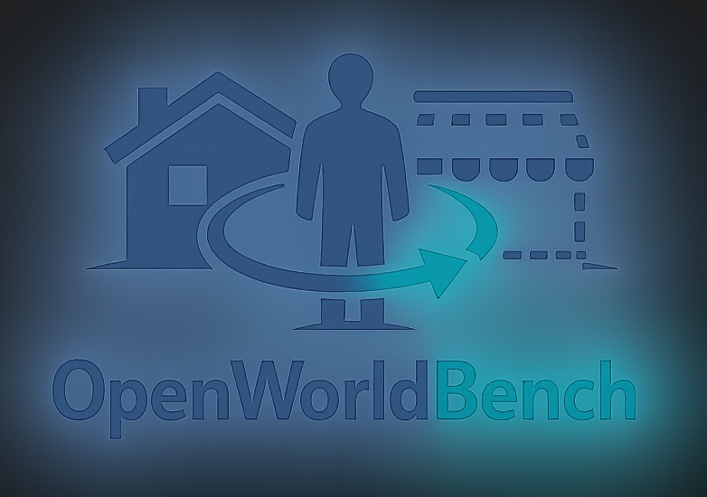

<p align="center">
  
</p>

#  OpenWorldBench

A benchmark for embodied model **reasoning** in real-world service scenarios.

[中文说明](README_zh.md)

## Overview

OpenWorldBench evaluates whether vision-language models acting as an **embodied brain** can complete full business tasks through **multi-turn high-level semantic tool calls** under **partial observability**. Each turn, the model outputs one structured action from the task instruction, current observation, and interaction history. The environment keeps hidden world state in SQLite, returns state changes and structured failure reasons after each action, and scores runs with a **goal DSL** plus **full trajectory diagnostics**.

Phase 1 targets **home service** and **retail service** scenarios: navigation, pick-and-place, containers and devices, dual-hand state, and multi-step planning. It does **not** evaluate joint control or low-level motion planning.

## Pipeline

```
Scenario/task JSON → compile → SQLite initial snapshot → MCP env (17 semantic actions)
→ model multi-turn tool calling → trajectory log → DSL verification + diagnostic report
```

| Stage | Command | Module |
|-------|---------|--------|
| Compile | `owb compile` | `owb/env/compile.py` |
| Environment | `owb env start` | `owb/env/server.py` |
| Agent run | `owb run` | `owb/run/` |
| Verify | `owb verify` | `owb/eval/verify.py` |
| Report | `owb report` | `owb/eval/report.py` |

## Quickstart

```bash
python -m venv .venv
source .venv/bin/activate
pip install -e .

owb compile \
  --scenario data/scenarios/home_01.json \
  --task data/tasks/home/home_01_umbrella_move.json \
  --output_dir outputs/compiled

owb env start \
  --db_path outputs/compiled/home_01_umbrella_move.db \
  --port 8001
```

Batch compile all tasks:

```bash
owb compile --batch true --output_dir outputs/compiled
```

## Data & specs

| Path | Description |
|------|-------------|
| `data/scenarios/` | Scenario packs (areas, adjacency, per-area entity tables) |
| `data/tasks/` | Task packs (instruction, goal DSL, subgoals, walkthrough solvability checks) |
| [data/scenarios/README.md](data/scenarios/README.md) | Scenario JSON spec v0.1 |
| [data/tasks/README.md](data/tasks/README.md) | Task JSON spec v0.1 |

## Package layout

| Path | Description |
|------|-------------|
| `owb/schema/` | Scenario/task Pydantic models + goal DSL |
| `owb/env/` | World state, actions, observe, compile, MCP server |
| `owb/run/` | Agent loop + task runner |
| `owb/eval/` | Verify / diagnose / report |
| `owb/synth/` | Legacy LLM synthesis pipeline (optional) |

## Repository status

Forked from [agent-world-model](https://github.com/Snowflake-Labs/agent-world-model) and refactored into the `owb` package. Scenario and task JSON specs are **frozen at v0.1**.
